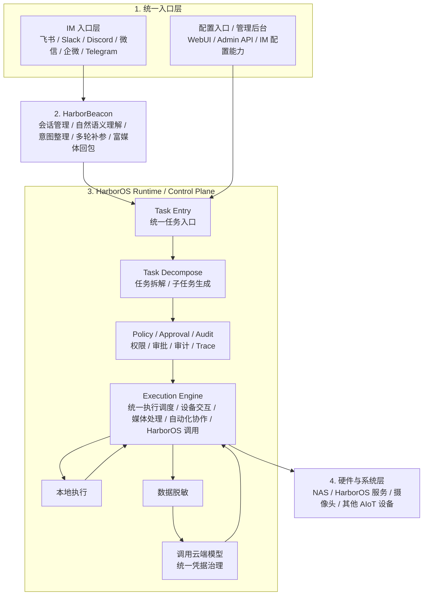
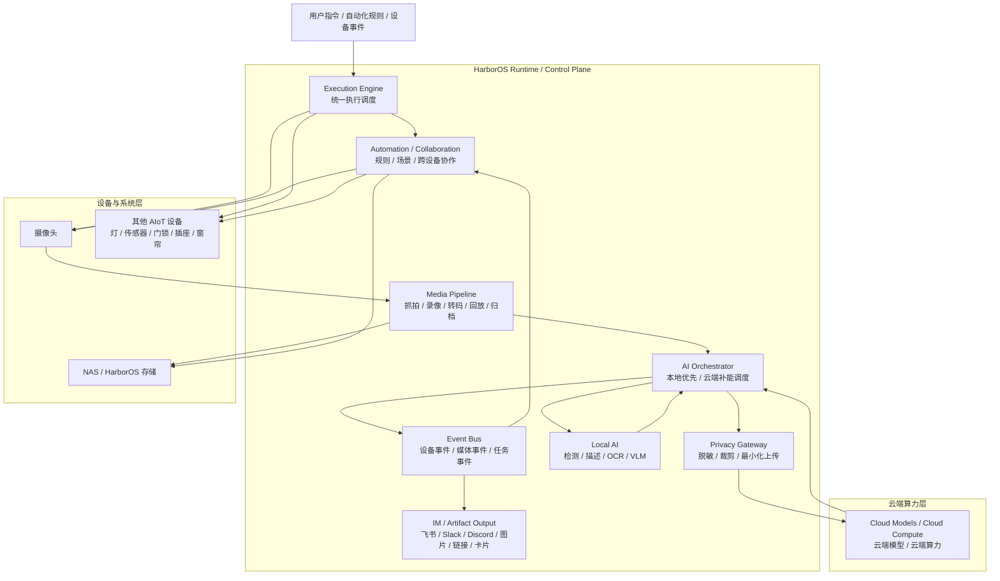
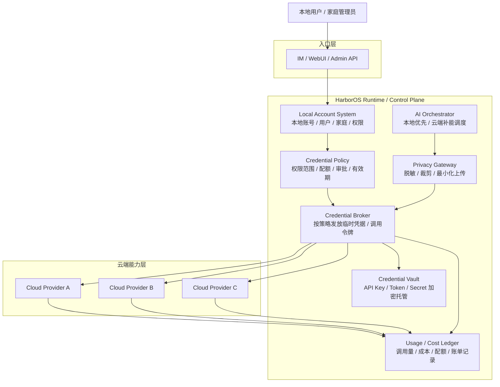

# Home Agent Hub 顶层设计

更新时间：2026-04-15

## 1. 项目定义

Home Agent Hub 是一个运行在 `Debian 13` 上的本地优先家庭智能平台，支持：

- 作为 `HarborOS` 内置子系统部署
- 作为独立 `ARM / X86 AI BOX` 部署
- 统一接入家庭设备、AI 模型、插件和工作流
- 通过 WebUI、IM、API、后续语音入口对外提供服务
- 支持多用户、多角色、多设备、多工作流治理

这个系统的产品目标不是单一 Agent，而是一个完整的：

- 家庭设备控制中枢
- AI 能力管理平台
- 可视化工作流编排平台
- HarborOS 协同运行平台

当前已经冻结的项目北极星定义是：

`一个以 IM 为统一入口、以设备协同和媒体数据流为核心、以本地优先与云端补能为原则、通过智能编排、数据脱敏与统一账号凭据治理，统一编排家庭 AIoT 设备与 NAS/HarborOS 的本地优先家庭智能平台。`

---

## 2. 基础约束

### 2.1 运行环境

- 操作系统：`Debian 13`
- 硬件形态：
  - `ARM AI BOX`
  - `X86 AI BOX`
  - `HarborOS Embedded`

### 2.2 技术栈

- 后端主服务：`Rust`
- WebUI：`Angular`
- 风格与工程体系：尽量对齐 `TrueNAS WebUI`
- AI 推理：本地 / 远程 sidecar，统一通过 provider 接口接入
- 数据存储：
  - 初期：`SQLite`
  - 后续可扩展到 `PostgreSQL`
- 流媒体：`RTSP` / `ONVIF` / `WebRTC` / `ffmpeg` / `gstreamer`
- 进程管理：`systemd`

### 2.3 架构原则

1. 本地优先，云端补能
2. Rust 承担核心运行时
3. AI 能力 sidecar 化，不与核心运行时强耦合
4. HarborOS 集成与独立 AI BOX 共用一套核心架构
5. WebUI 既要能做管理员后台，也要能承载普通用户前台入口
6. 所有云调用都必须经过数据脱敏与统一凭据治理

---

## 3. 部署形态

## 3.1 HarborOS Embedded

角色：
- HarborOS 的 Home Agent 子系统

特点：
- 深度接入 HarborOS 账户、存储、WebUI、权限体系
- 适合 NAS + Home Hub 一体部署

## 3.2 AI BOX Standalone

角色：
- 独立家庭设备中枢
- 本地 AI 推理与自动化节点

特点：
- 直接接入家庭局域网设备
- 可选对接 HarborOS 作为存储与控制平面

## 3.3 Hybrid Cluster

角色分工：
- AI BOX：设备发现、低延迟控制、流处理、边缘推理
- HarborOS：媒体归档、知识库、后台管理、重任务 AI、长期治理

这是推荐形态。

---

## 4. 总体架构

### 4.1 整体主框架



这张图冻结了四个关键边界：

- `IM 入口` 与 `配置入口 / 管理后台` 是并列的北向入口
- `HarborBeacon` 只负责交互与语义整理，不直接访问云端模型、凭据系统或设备后端
- `HarborOS Runtime / Control Plane` 是唯一的任务拆解、审批审计、执行决策与统一调度中心
- `本地优先 / 云端补能` 是执行路径，不是独立主层

完整数据模型见：[platform-home-agent-hub-data-model.md](./platform-home-agent-hub-data-model.md)

### 4.2 设备协作与媒体数据流



这张图固定了：

- 设备协作通过 `Event Bus + Automation` 驱动，而不是彼此硬编码调用
- 摄像头媒体数据由 `Media Pipeline` 负责抓拍、录像、转码和归档到 NAS
- 云端算力调用必须经过 `AI Orchestrator -> Privacy Gateway -> Cloud Models`

### 4.3 统一账号 / 凭据 / 云端治理



这张图固定了两条治理原则：

- 业务模块不直接持有裸 `API key / token`，只通过 `Credential Broker` 获取受控凭据
- 所有云调用都必须经过 `Privacy Gateway` 和 `Usage / Cost Ledger`

---

## 5. 分层设计

## 5.1 Entry Layer

提供统一入口：

- 普通用户前台 WebUI
- 管理员后台 WebUI
- IM 入口
- Open API
- 后续语音入口

这一层只负责“进入系统”，不负责核心执行。

## 5.2 Control Plane

这是管理和治理层，负责：

- 用户与身份管理
- 角色与权限
- 设备管理
- 模型管理
- 插件管理
- 工作流设计与发布
- 节点运行监控
- 审计和审批

这一层对应你说的“后台管理平台”。

## 5.3 Orchestration Plane

这是智能编排层，负责：

- 将自然语言、事件、定时器转成结构化任务
- 解析场景与设备目标
- 选择执行节点
- 选择本地 / 远程模型
- 生成工作流执行计划
- 风险审批与审计记录

这一层可复用当前 `orchestrator` 的设计思路。

## 5.4 Runtime Plane

这是运行时核心，负责：

- 设备发现
- 设备注册
- 设备状态缓存
- 事件总线
- 工作流节点调度
- 自动化执行
- 媒体管线处理

建议以 Rust 为主。

## 5.5 Execution Plane

真正执行动作的底层能力层：

- `ONVIF / RTSP / Matter / SSDP / mDNS`
- HarborOS `Middleware API / MidCLI`
- LLM / VLM / OCR / ASR provider
- 文件、媒体、通知、Webhook 等动作输出

---

## 6. 后端模块划分

建议后端最终演进为以下模块。

```text
src/
  control_plane/
    auth/
    users/
    roles/
    approvals/
    models/
    plugins/
    workflows/
    devices/
    audit/
  orchestrator/
    intent/
    planner/
    policy/
    routing/
    scheduler/
  runtime/
    registry/
    discovery/
    events/
    automation/
    media/
    node_runtime/
    topology/
  connectors/
    harboros/
    ai_provider/
    notifications/
    storage/
  adapters/
    onvif/
    rtsp/
    matter/
    mdns/
    ssdp/
```

---

## 7. 协议栈设计

## 7.1 平台内部协议

- WebUI → Backend：
  - `HTTPS REST`
  - `WebSocket` 或 `SSE`
- Control Plane → Runtime：
  - 进程内调用优先
  - 跨进程时可用 `gRPC` 或内部 `HTTP`
- Runtime → AI Provider：
  - `HTTP JSON`
  - OpenAI-compatible API 优先

## 7.2 设备协议

- 发现：
  - `mDNS`
  - `SSDP / UPnP`
  - `ONVIF WS-Discovery`
- 摄像头控制：
  - `ONVIF`
- 视频流：
  - `RTSP`
- 智能家居：
  - `Matter`
- 厂商扩展：
  - 私有 adapter plugin

## 7.3 HarborOS 协议

HarborOS 系统域保留：

- `Middleware API`
- `MidCLI`

推荐路由：

- `system` 域：`Middleware API -> MidCLI -> MCP fallback`
- `device` 域：`Native Adapter -> LAN Bridge -> HarborOS Connector`

---

## 8. AI 模型管理设计

## 8.1 Model Hub 目标

统一管理：

- LLM
- VLM
- OCR
- ASR
- Detection / Tracking
- Embedding 模型

## 8.2 模型对象

建议模型元数据至少包含：

- `model_id`
- `name`
- `kind`
- `provider_type`
- `endpoint`
- `model_name`
- `deployment_target`
- `capability_tags`
- `health_status`
- `avg_latency_ms`
- `throughput`
- `enabled`

### `kind` 建议值

- `llm`
- `vlm`
- `ocr`
- `asr`
- `detector`
- `embedder`

### `provider_type` 建议值

- `local-sidecar`
- `openai-compatible`
- `remote-cloud`
- `harboros-service`

## 8.3 调用策略

模型调用必须经过统一网关：

- 选择可用 provider
- 读取限流策略
- 读取权限策略
- 记录审计
- 记录性能指标

不能让工作流节点直接各自乱调模型。

---

## 9. 插件管理设计

## 9.1 插件类型

建议平台插件统一分四类：

- `device-adapter`
- `ai-node`
- `workflow-node`
- `system-connector`

## 9.2 插件 Manifest

每个插件统一包含：

- `plugin_id`
- `name`
- `version`
- `kind`
- `runtime_type`
- `input_schema`
- `output_schema`
- `config_schema`
- `required_permissions`
- `healthcheck`

## 9.3 运行方式

建议优先支持三种：

- `native-rust`
- `http-sidecar`
- `wasm-sandbox`（后续）

不建议早期做过于自由的“任意脚本插件”。

---

## 10. 工作流平台设计

## 10.1 Workflow Studio 目标

提供可视化拖拽编排，支持：

- 输入节点
- AI 节点
- 条件判断节点
- 动作节点
- 输出节点

典型流程：

`摄像头输入 -> 人形检测 -> LLM复核 -> 条件判断 -> 通知 / 开灯 / 录像`

## 10.2 工作流对象

建议工作流核心对象：

- `workflow_id`
- `name`
- `description`
- `scope`
- `status`
- `version`
- `trigger`
- `nodes`
- `edges`
- `deployment_target`
- `created_by`
- `updated_by`

## 10.3 节点对象

统一节点抽象：

- `node_id`
- `node_type`
- `plugin_ref`
- `inputs`
- `outputs`
- `config`
- `error_policy`
- `runtime_requirements`

### `node_type` 建议值

- `source`
- `ai`
- `transform`
- `condition`
- `action`
- `sink`

## 10.4 工作流执行引擎

Rust Runtime 负责：

- 校验 workflow schema
- DAG 调度
- 事件驱动执行
- 重试和超时控制
- 节点级日志
- 执行快照
- 调试重放

## 10.5 工作流模板

平台应支持模板：

- 门口有人检测通知
- 快递到门提醒
- 宠物活动识别
- 老人异常停留提醒
- 来客时开灯并推送截图

---

## 11. 多用户与权限模型

## 11.1 基本原则

系统必须从一开始支持多用户，而不是后补。

## 11.2 核心对象

- `Home`
- `User`
- `Group`
- `Role`
- `Membership`
- `PermissionBinding`
- `Session`
- `ApprovalRequest`
- `AuditEvent`

## 11.3 身份来源

建议统一支持：

- 本地账号
- HarborOS 账号映射
- IM 账号映射

统一内部用户模型。

## 11.4 角色模型

建议最少角色：

- `owner`
- `admin`
- `operator`
- `member`
- `viewer`
- `guest`

## 11.5 权限作用域

权限要支持以下作用域：

- `platform`
- `home`
- `room`
- `resource`

## 11.6 资源权限

资源至少包括：

- 设备
- 摄像头流
- 工作流
- 插件
- 模型
- 文件
- 告警
- 日志

## 11.7 审批机制

高风险动作进入审批：

- 查看敏感摄像头
- 导出视频
- 安装插件
- 删除工作流
- 切换模型提供者
- 控制门锁 / 安防类设备

---

## 12. 前台 WebUI 设计

这里的“前台”指面向普通用户和家庭成员的使用界面，不是管理员后台。

## 12.1 前台目标

提供简洁、日常可用的入口，用于：

- 看设备状态
- 看摄像头
- 触发常用场景
- 接收告警
- 查看事件
- 与 Home Agent 对话

## 12.2 前台页面结构

### A. 首页 Dashboard

展示：

- 家庭概览
- 在线设备数
- 今日事件数
- 最近告警
- 常用场景快捷卡片
- Agent 对话入口

### B. 设备页 Devices

展示：

- 房间分组
- 设备在线状态
- 设备类型卡片
- 最近事件
- 快捷控制按钮

### C. 摄像头页 Cameras

展示：

- 摄像头实时画面
- 历史截图
- 事件时间线
- PTZ 控制
- 视角与隐私状态提示

### D. 场景页 Scenes

展示：

- 回家模式
- 离家模式
- 夜间模式
- 看门口
- 睡眠模式

支持一键触发。

### E. 告警页 Alerts

展示：

- 人员出现
- 异常停留
- 门磁触发
- 设备离线
- 规则执行失败

### F. 事件页 Timeline

展示：

- 按时间线查看图片、视频片段、检测结果、系统动作

### G. 对话页 Agent Chat

支持：

- 自然语言控制设备
- 查询状态
- 查询事件
- 触发工作流

### H. 个人中心 Profile

展示：

- 账号信息
- 家庭成员与权限摘要
- 通知渠道
- 隐私设置

---

## 13. 后台 WebUI 设计

这里的“后台”指面向管理员和高级用户的控制台。

## 13.1 后台目标

支持：

- 设备治理
- 模型治理
- 插件治理
- 工作流设计
- 运行监控
- 多用户权限管理

## 13.2 后台页面结构

### A. 总览 Overview

展示：

- 设备健康
- 模型健康
- 运行中工作流
- 告警
- CPU / NPU / 内存 / 温度

### B. 设备中心 Device Center

支持：

- 自动发现
- 手工接入
- 设备分组
- 房间绑定
- 能力查看
- 在线/离线状态

### C. 模型中心 Model Hub

支持：

- 查看模型列表
- 添加 provider
- 启停模型
- 测试调用
- 查看吞吐、延迟、资源消耗

### D. 插件中心 Plugin Hub

支持：

- 安装插件
- 升级插件
- 停用插件
- 查看 manifest
- 配置权限

### E. 工作流工作台 Workflow Studio

支持：

- 拖拽节点
- 连线
- 参数配置
- 运行测试
- 发布
- 版本管理

### F. 节点运行监控 Runtime Monitor

支持：

- 查看各工作流运行情况
- 单次执行链路
- 错误日志
- 节点输入输出快照

### G. 用户与权限 User & Access

支持：

- 用户管理
- 角色管理
- 家庭成员管理
- 资源授权
- 审批策略

### H. 系统设置 System Settings

支持：

- HarborOS 连接配置
- IM 连接配置
- 存储策略
- 日志策略
- 备份恢复

---

## 14. WebUI 信息架构建议

建议前后台共用同一 Angular 工程，但分成两套应用壳层。

```text
webui/
  apps/
    portal/         # 普通用户前台
    admin/          # 管理后台
  shared/
    ui/
    api/
    auth/
    models/
    workflow/
```

### portal 导航建议

- 首页
- 设备
- 摄像头
- 场景
- 告警
- 时间线
- Agent
- 我

### admin 导航建议

- 总览
- 设备中心
- 模型中心
- 插件中心
- 工作流
- 运行监控
- 用户与权限
- 系统设置

---

## 15. API 设计建议

建议 API 按资源域划分。

### 前台相关

- `/api/portal/dashboard`
- `/api/devices`
- `/api/cameras`
- `/api/scenes`
- `/api/alerts`
- `/api/timeline`
- `/api/chat`

### 后台相关

- `/api/admin/overview`
- `/api/admin/models`
- `/api/admin/plugins`
- `/api/admin/workflows`
- `/api/admin/runtime`
- `/api/admin/users`
- `/api/admin/roles`
- `/api/admin/approvals`

### 事件流

- `/api/events/stream`
- `/api/runtime/executions/{id}`

---

## 16. 数据存储建议

初期建议单库优先，便于部署。

### 主数据库

优先：
- `SQLite`

后续：
- `PostgreSQL`

### 核心表建议

平台最终以独立的数据模型文档为准：

- [platform-home-agent-hub-data-model.md](./platform-home-agent-hub-data-model.md)

当前推荐的最小核心表分组：

- `workspaces / users / identity_bindings / memberships / rooms`
- `provider_accounts / credential_records / credential_leases / usage_ledger`
- `devices / device_endpoints / provider_bindings / device_capabilities / device_twins`
- `camera_profiles / stream_profiles / media_assets / media_sessions / share_links`
- `conversation_sessions / task_runs / task_step_runs / artifact_records / approval_tickets / audit_records`
- `event_records / automation_rules / automation_versions / automation_runs / scene_definitions / scene_members`
- `model_endpoints / model_route_policies / privacy_transform_records / inference_runs`

### 媒体与文件

- 媒体文件本地存储
- 元数据入库
- HarborOS 模式下可落 HarborOS 存储池

---

## 17. 可观测性设计

需要统一监控：

- 设备在线率
- 工作流成功率
- 节点失败率
- 模型调用延迟
- 吞吐量
- CPU / NPU / 内存 / 温度
- 视频流状态
- 插件健康状态

建议：

- 指标：Prometheus 风格
- 日志：结构化日志
- 审计：独立 audit stream
- WebUI：提供运行监控面板

---

## 18. 安全与隐私

## 18.1 本地优先

- 视频默认不出网
- 用户隐私数据优先本地处理

## 18.2 权限隔离

- 设备流、模型配置、插件安装都要权限校验

## 18.3 审计

- 所有高风险动作必须可追溯

## 18.4 插件安全

- 插件权限显式声明
- 插件安装带签名或来源信任机制

---

## 19. 实施阶段建议

当前优先级不再是同时铺开全部平台能力，而是先完成一个可持续复用的 MVP 主链路：

`局域网自动扫描 -> 识别可用 RTSP 摄像头 -> 抓帧 -> AI 检测 -> 截图推送到 IM`

说明：

- 发现层使用 `ONVIF / SSDP / mDNS / RTSP Probe`
- 媒体输入层以 `RTSP` 为 MVP 主协议

## Phase 1: Device Discovery

目标：
- 自动扫描局域网中的候选设备
- 自动识别可用 RTSP 摄像头
- 统一设备注册
- 后台可查看设备列表

## Phase 2: Snapshot Pipeline

目标：
- 通过 RTSP/媒体管线抓取截图
- 前台和后台都能查看结果

## Phase 3: AI Detection

目标：
- 接入最小 AI provider
- 对截图执行一次检测或描述

## Phase 4: IM Notification

目标：
- 把截图和检测结果推送到飞书等 IM

## Phase 5: MVP Governance

目标：
- 补最小权限、配置、监控和审计

MVP 完成后再扩展：

- PTZ 控制
- 多摄像头
- 拖拽 Workflow Studio
- Matter / Light / Sensor 联动
- HarborOS 深度媒体归档

---

## 20. 顶层结论

Home Agent Hub 应正式定义为：

一个运行在 Debian 13 上、以 Rust 为核心运行时、以 Angular 为统一 WebUI、支持 HarborOS 集成、支持多用户治理、支持模型与插件管理、支持拖拽工作流编排的家庭 AI 控制与自动化平台。

其结构上包含两类 UI 和四类核心平台能力：

### 两类 UI

- 普通用户前台
- 管理员后台

### 四类核心平台能力

- 家庭设备中枢
- AI 模型与插件平台
- 可视化工作流平台
- 多用户权限与审计平台
