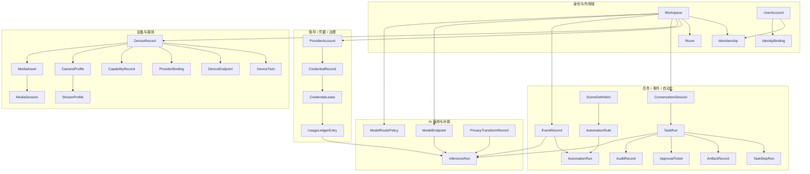

# Platform + Home Agent Hub Data Model

更新时间：2026-04-15

## 1. 目标

这份文档用于冻结平台级数据模型，作为后续 `Rust schema`、`SQLite / PostgreSQL`、`Admin API`、`HarborBeacon Task API`、`WebUI` 和 `Provider` 接口的共同来源。

本次数据模型有三个硬目标：

1. 先定义平台对象，再定义摄像头对象
2. 先定义通用绑定和能力模型，再定义品牌字段
3. 先定义状态、事件、媒体、凭据和审计，再定义具体页面和接口

当前固定的项目北极星定义是：

`一个以 IM 为统一入口、以设备协同和媒体数据流为核心、以本地优先与云端补能为原则、通过智能编排、数据脱敏与统一账号凭据治理，统一编排家庭 AIoT 设备与 NAS/HarborOS 的本地优先家庭智能平台。`

---

## 2. 建模原则

### 2.1 平台优先，不摄像头优先

核心主对象不是 `CameraDevice`，而是更通用的：

- `Workspace`
- `UserAccount`
- `DeviceRecord`
- `TaskRun`
- `EventRecord`
- `MediaAsset`
- `ProviderAccount`

摄像头是 `DeviceRecord` 的一个高复杂度子域，而不是根对象。

### 2.2 设备本体与接入方式分离

设备自身身份与品牌接入方式必须拆开：

- `DeviceRecord` 表示“这是什么设备”
- `ProviderBinding` 表示“它通过什么协议 / 品牌 / 网关接入”
- `CapabilityRecord` 表示“它现在具备什么能力”

核心模型里不再继续增加 `ezviz_device_serial` 这类厂商专用字段。

### 2.3 状态与事件分离

- `EventRecord` 是不可变事件流
- `DeviceTwin` 是当前状态投影
- `TaskRun` / `AutomationRun` / `InferenceRun` 是过程状态

不要把“历史事件”和“当前状态”混成一个字段。

### 2.4 凭据不进入业务对象

- 业务对象只保存 `credential_ref`
- 裸 `api_key / token / secret` 只存在于 `CredentialVault`
- 所有云端调用都通过 `CredentialBroker`

### 2.5 媒体数据与元数据分离

- 二进制媒体文件落 `NAS / HarborOS 存储`
- 数据库只保存 `MediaAsset` 和 `StorageObjectRef`
- 任务、事件、AI 结果都通过引用媒体资产关联

### 2.6 先关系型骨架，再 JSON 扩展

初期数据库推荐采用“稳定列 + JSON 扩展字段”的混合设计：

- 高频过滤和关联字段用结构化列
- 快速演化的供应商特性、模型参数、事件 payload 用 `json`

---

## 3. 数据模型总览

可以把整套模型理解成 5 个实体簇：

1. `身份与作用域`
2. `账号 / 凭据 / 治理`
3. `设备 / 数字孪生 / 媒体`
4. `任务 / 事件 / 自动化 / 审计`
5. `AI 编排 / 脱敏 / 云端补能`

---

## 4. 通用基类字段

所有需要持久化的主对象，建议至少带以下字段：

| 字段 | 说明 |
| --- | --- |
| `id` | 全局唯一主键，推荐 `uuid` |
| `workspace_id` | 所属作用域；系统级对象可为空 |
| `status` | 生命周期或运行状态 |
| `source` | 创建来源，如 `manual`、`imported`、`discovered`、`system` |
| `metadata` | 扩展 JSON，不放高频过滤字段 |
| `created_at` | 创建时间 |
| `updated_at` | 更新时间 |
| `deleted_at` | 软删除时间，可为空 |

---

## 5. 身份与作用域模型

### 5.1 `Workspace`

`Workspace` 是顶层隔离边界。对当前产品来说，一个 `Workspace` 基本等价于一个“家庭 / 家空间”，但名字保持中性，方便后续扩到托管或商业场景。

| 字段 | 说明 |
| --- | --- |
| `workspace_id` | 工作区主键 |
| `workspace_type` | `home / lab / managed` |
| `display_name` | 对外显示名称 |
| `timezone` | 本地时区 |
| `locale` | 默认语言区域 |
| `owner_user_id` | 所有者 |
| `status` | `active / suspended / archived` |
| `settings` | 平台默认配置 JSON |

### 5.2 `UserAccount`

| 字段 | 说明 |
| --- | --- |
| `user_id` | 用户主键 |
| `display_name` | 显示名称 |
| `email` | 邮箱，可为空 |
| `phone` | 手机号，可为空 |
| `status` | `active / invited / disabled` |
| `default_workspace_id` | 默认进入的工作区 |
| `preferences` | 用户偏好 JSON |

### 5.3 `IdentityBinding`

用于连接本地用户与外部身份来源。

| 字段 | 说明 |
| --- | --- |
| `identity_id` | 绑定主键 |
| `user_id` | 本地用户 |
| `auth_source` | `local / harboros / im_channel` |
| `provider_key` | `feishu / slack / discord / wechat / harboros` |
| `external_user_id` | 外部用户标识 |
| `external_union_id` | 外部联合标识，可为空 |
| `external_chat_id` | 默认会话，可为空 |
| `profile_snapshot` | 外部资料快照 JSON |
| `last_seen_at` | 最近活跃时间 |

### 5.4 `Membership`

| 字段 | 说明 |
| --- | --- |
| `membership_id` | 成员关系主键 |
| `workspace_id` | 工作区 |
| `user_id` | 用户 |
| `role_kind` | `owner / admin / operator / member / viewer / guest` |
| `status` | `active / pending / revoked` |
| `granted_by_user_id` | 授权人 |
| `granted_at` | 授权时间 |

### 5.5 `Room`

设备、场景和语义解析都要绑定房间。

| 字段 | 说明 |
| --- | --- |
| `room_id` | 房间主键 |
| `workspace_id` | 工作区 |
| `name` | 房间名 |
| `floor` | 楼层，可为空 |
| `zone_type` | `living_room / bedroom / entrance / kitchen / outdoor` |
| `aliases` | 别名 JSON |

---

## 6. 云账号 / 凭据治理模型

### 6.1 `ProviderAccount`

表示一个可被平台统一治理的云端或桥接账号。

| 字段 | 说明 |
| --- | --- |
| `provider_account_id` | 主键 |
| `workspace_id` | 所属工作区 |
| `provider_key` | 如 `openai`、`ezviz`、`xiaomi_home` |
| `provider_kind` | `ai_cloud / vendor_cloud / vendor_local / bridge / harboros` |
| `display_name` | 管理台展示名称 |
| `owner_scope` | `workspace / user / system` |
| `owner_user_id` | 用户级账号时填写 |
| `status` | `active / needs_reauth / disabled` |
| `capabilities` | 支持能力 JSON |

### 6.2 `CredentialRecord`

这里只放凭据元数据，不放明文 secret。

| 字段 | 说明 |
| --- | --- |
| `credential_id` | 主键 |
| `provider_account_id` | 所属 provider 账号 |
| `credential_kind` | `api_key / oauth_token / refresh_token / device_token / session_secret` |
| `vault_key` | 密文在 Vault 中的定位键 |
| `scope` | 作用域 JSON |
| `expires_at` | 过期时间，可为空 |
| `rotation_state` | `valid / expiring / revoked / invalid` |
| `last_verified_at` | 最近校验时间 |

### 6.3 `CredentialLease`

运行时临时下发的可追踪凭据租约。

| 字段 | 说明 |
| --- | --- |
| `lease_id` | 主键 |
| `credential_id` | 来源凭据 |
| `issued_to_kind` | `task / inference / provider_binding / share_session` |
| `issued_to_id` | 被发放对象 |
| `lease_scope` | 下发范围 JSON |
| `issued_at` | 发放时间 |
| `expires_at` | 过期时间 |
| `revoked_at` | 撤销时间，可为空 |

### 6.4 `UsageLedgerEntry`

为后续云 token 聚合、计量和账单能力预留。

| 字段 | 说明 |
| --- | --- |
| `ledger_id` | 主键 |
| `workspace_id` | 工作区 |
| `provider_account_id` | 云账号 |
| `credential_id` | 使用的凭据，可为空 |
| `usage_type` | `model_inference / vendor_api / media_proxy / webhook` |
| `request_units` | 请求量 |
| `input_bytes` | 输入字节数 |
| `output_bytes` | 输出字节数 |
| `cost_amount` | 成本数值 |
| `cost_currency` | 货币 |
| `task_id` | 关联任务，可为空 |
| `inference_run_id` | 关联推理，可为空 |
| `occurred_at` | 发生时间 |

---

## 7. 设备注册中心与数字孪生模型

### 7.1 `DeviceRecord`

这是平台设备中心的根对象。

| 字段 | 说明 |
| --- | --- |
| `device_id` | 设备主键 |
| `workspace_id` | 工作区 |
| `kind` | `camera / light / sensor / lock / gateway / nas / service / unknown` |
| `subtype` | 细分类，如 `ptz_camera`、`door_sensor` |
| `display_name` | 展示名称 |
| `aliases` | 自然语言别名 JSON |
| `vendor` | 品牌，可为空 |
| `model` | 型号，可为空 |
| `serial_number` | 序列号，可为空 |
| `mac_address` | 主 MAC，可为空 |
| `primary_room_id` | 所属房间，可为空 |
| `lifecycle_state` | `discovered / registered / active / disabled / retired` |
| `source` | `manual / discovered / imported / bridged` |

### 7.2 `DeviceEndpoint`

一个设备可以有多个网络入口。

| 字段 | 说明 |
| --- | --- |
| `endpoint_id` | 主键 |
| `device_id` | 设备 |
| `endpoint_kind` | `ipv4 / ipv6 / mac / rtsp / onvif / matter / http / websocket` |
| `scheme` | `rtsp / http / https / udp / matter` |
| `host` | 地址 |
| `port` | 端口，可为空 |
| `path` | 路径，可为空 |
| `requires_auth` | 是否鉴权 |
| `reachability_status` | `online / offline / degraded / unknown` |
| `last_seen_at` | 最近发现时间 |

### 7.3 `ProviderBinding`

同一设备可能被多种 provider 同时接入。

| 字段 | 说明 |
| --- | --- |
| `binding_id` | 主键 |
| `device_id` | 设备 |
| `provider_account_id` | 可为空；本地标准协议时可不依赖云账号 |
| `provider_key` | `onvif / rtsp / matter / ezviz / xiaomi / home_assistant` |
| `provider_kind` | `standard / vendor_cloud / vendor_local / bridge` |
| `remote_device_id` | 厂商侧设备标识 |
| `credential_ref` | 使用哪个凭据记录 |
| `binding_status` | `active / invalid / pending / revoked` |
| `support_mode` | `native / cloud / bridge / lab` |
| `metadata` | 厂商特有附加信息 JSON |
| `last_sync_at` | 最近同步时间 |

### 7.4 `CapabilityRecord`

平台统一能力模型。

| 字段 | 说明 |
| --- | --- |
| `capability_id` | 主键 |
| `device_id` | 设备 |
| `capability_code` | 如 `snapshot`、`stream_live`、`ptz`、`lock`、`switch`、`temperature_read` |
| `category` | `state / control / stream / media / event` |
| `access_mode` | `read / write / invoke / subscribe` |
| `support_mode` | `native / cloud / bridge / lab / unsupported` |
| `availability` | `available / unavailable / degraded` |
| `source_binding_id` | 来自哪个 provider binding |

### 7.5 `DeviceTwin`

用于承载当前状态，不保存历史。

| 字段 | 说明 |
| --- | --- |
| `device_id` | 与设备一对一 |
| `connectivity_state` | 连接状态 |
| `reported_state` | 当前状态 JSON |
| `desired_state` | 期望状态 JSON |
| `health_state` | 健康状态 JSON |
| `last_event_id` | 最近一次驱动该状态的事件 |
| `last_seen_at` | 最近在线时间 |

---

## 8. 摄像头与媒体模型

### 8.1 `CameraProfile`

摄像头能力扩展档案，不污染通用设备模型。

| 字段 | 说明 |
| --- | --- |
| `device_id` | 对应 `DeviceRecord` |
| `default_stream_profile_id` | 默认码流 |
| `audio_supported` | 是否支持音频 |
| `ptz_supported` | 是否支持云台 |
| `privacy_supported` | 是否支持隐私模式 |
| `playback_supported` | 是否支持回放 |
| `recording_policy_id` | 当前录制策略 |
| `vendor_features` | 摄像头特有扩展 JSON |

### 8.2 `StreamProfile`

| 字段 | 说明 |
| --- | --- |
| `stream_profile_id` | 主键 |
| `device_id` | 设备 |
| `profile_name` | `main`、`sub`、`event` |
| `transport` | `rtsp / hls / webrtc / file` |
| `endpoint_id` | 对应的 `DeviceEndpoint` |
| `video_codec` | 视频编码 |
| `audio_codec` | 音频编码，可为空 |
| `width` | 宽度 |
| `height` | 高度 |
| `fps` | 帧率 |
| `bitrate_kbps` | 码率 |
| `is_default` | 是否默认码流 |

### 8.3 `PtzProfile`

| 字段 | 说明 |
| --- | --- |
| `ptz_profile_id` | 主键 |
| `device_id` | 设备 |
| `provider_binding_id` | 使用哪条控制绑定 |
| `control_mode` | `onvif / vendor_cloud / vendor_local` |
| `presets` | 预置位 JSON |
| `pan_range` | 云台水平范围 JSON |
| `tilt_range` | 云台垂直范围 JSON |
| `zoom_range` | 变焦范围 JSON |

### 8.4 `RecordingPolicy`

| 字段 | 说明 |
| --- | --- |
| `recording_policy_id` | 主键 |
| `workspace_id` | 可做工作区默认策略 |
| `device_id` | 可为空；为空表示全局策略 |
| `trigger_mode` | `continuous / event / manual / schedule` |
| `pre_event_seconds` | 事件前缓存秒数 |
| `post_event_seconds` | 事件后录制秒数 |
| `clip_length_seconds` | 单片段长度 |
| `retention_days` | 保留天数 |
| `storage_target` | `nas / local_disk / harboros_pool` |

### 8.5 `MediaAsset`

所有截图、录像片段、回放导出和中间产物都统一归这里。

| 字段 | 说明 |
| --- | --- |
| `asset_id` | 主键 |
| `workspace_id` | 工作区 |
| `device_id` | 来源设备，可为空 |
| `asset_kind` | `snapshot / clip / recording / replay / derived / report` |
| `storage_target` | 存储位置类别 |
| `storage_uri` | NAS 或对象路径 |
| `mime_type` | MIME 类型 |
| `byte_size` | 字节数 |
| `checksum` | 校验值 |
| `captured_at` | 抓拍时间，可为空 |
| `started_at` | 开始时间，可为空 |
| `ended_at` | 结束时间，可为空 |
| `derived_from_asset_id` | 派生来源，可为空 |
| `tags` | 标签 JSON |

### 8.6 `MediaSession`

| 字段 | 说明 |
| --- | --- |
| `media_session_id` | 主键 |
| `device_id` | 设备 |
| `stream_profile_id` | 码流 |
| `session_kind` | `live_view / replay / share / proxy` |
| `delivery_mode` | `local_player / webrtc / hls / download` |
| `opened_by_user_id` | 发起人 |
| `status` | `opening / active / closed / failed` |
| `share_link_id` | 分享链路，可为空 |
| `started_at` | 开始时间 |
| `ended_at` | 结束时间，可为空 |

### 8.7 `ShareLink`

| 字段 | 说明 |
| --- | --- |
| `share_link_id` | 主键 |
| `media_session_id` | 来源会话 |
| `token_hash` | 分享令牌哈希 |
| `access_scope` | `public_link / workspace / invite_only` |
| `expires_at` | 过期时间 |
| `revoked_at` | 撤销时间，可为空 |

---

## 9. 会话、任务、审批与审计模型

### 9.1 `ConversationSession`

HarborBeacon 进来后首先落到这里。

| 字段 | 说明 |
| --- | --- |
| `session_id` | 主键 |
| `workspace_id` | 工作区 |
| `channel` | `feishu / slack / discord / webui` |
| `surface` | `im / admin / mobile / api` |
| `conversation_id` | 外部会话 ID |
| `user_id` | 当前用户 |
| `state` | 补参和上下文 JSON |
| `resume_token` | 可恢复令牌，可为空 |
| `expires_at` | 过期时间 |

### 9.2 `TaskRun`

这是统一任务入口的主对象。

| 字段 | 说明 |
| --- | --- |
| `task_id` | 主键 |
| `workspace_id` | 工作区 |
| `session_id` | 来源会话 |
| `source_channel` | 任务来源通道 |
| `domain` | 如 `device`、`camera`、`vision`、`system` |
| `action` | 如 `scan`、`snapshot`、`analyze` |
| `intent_text` | 用户原始意图 |
| `entity_refs` | 结构化实体引用 JSON |
| `args` | 参数 JSON |
| `autonomy_level` | 自主等级 |
| `status` | `queued / running / needs_input / blocked / completed / failed` |
| `risk_level` | `low / medium / high / critical` |
| `requires_approval` | 是否必须审批 |
| `started_at` | 启动时间 |
| `completed_at` | 完成时间，可为空 |

### 9.3 `TaskStepRun`

| 字段 | 说明 |
| --- | --- |
| `step_id` | 主键 |
| `task_id` | 任务 |
| `domain` | 步骤所属域 |
| `operation` | 具体操作 |
| `route` | `local / cloud / middleware_api / midcli / browser / mcp` |
| `executor_used` | 执行器 |
| `status` | `pending / approved / executing / success / failed / blocked / skipped` |
| `input_payload` | 输入 JSON |
| `output_payload` | 输出 JSON |
| `error_code` | 错误码，可为空 |
| `error_message` | 错误消息，可为空 |
| `audit_ref` | 对应审计记录 |
| `started_at` | 开始时间 |
| `ended_at` | 结束时间，可为空 |

### 9.4 `ArtifactRecord`

| 字段 | 说明 |
| --- | --- |
| `artifact_id` | 主键 |
| `task_id` | 来源任务 |
| `step_id` | 来源步骤，可为空 |
| `artifact_kind` | `text / image / video / link / card / json` |
| `label` | 展示名称 |
| `mime_type` | MIME 类型 |
| `media_asset_id` | 关联媒体资产，可为空 |
| `path` | 本地路径，可为空 |
| `url` | 可访问地址，可为空 |
| `metadata` | 扩展 JSON |

### 9.5 `ApprovalTicket`

| 字段 | 说明 |
| --- | --- |
| `approval_id` | 主键 |
| `task_id` | 来源任务 |
| `policy_ref` | 触发的策略 |
| `requester_user_id` | 发起人 |
| `approver_user_id` | 审批人，可为空 |
| `status` | `pending / approved / rejected / expired / cancelled` |
| `reason` | 申请原因 |
| `requested_at` | 发起时间 |
| `decided_at` | 决策时间，可为空 |

### 9.6 `AuditRecord`

| 字段 | 说明 |
| --- | --- |
| `audit_id` | 主键 |
| `workspace_id` | 工作区 |
| `entity_kind` | `task / step / device / credential / approval / inference` |
| `entity_id` | 对应对象 |
| `action` | 执行动作 |
| `actor_kind` | `user / system / model / provider` |
| `actor_id` | 执行主体 |
| `request_snapshot` | 请求快照 JSON |
| `result_snapshot` | 结果快照 JSON |
| `created_at` | 审计时间 |

---

## 10. 事件、自动化与场景模型

### 10.1 `EventRecord`

事件是平台协作主干，采用 append-only 思路。

| 字段 | 说明 |
| --- | --- |
| `event_id` | 主键 |
| `workspace_id` | 工作区 |
| `source_kind` | `device / media / task / automation / system / inference` |
| `source_id` | 来源对象 |
| `event_type` | 如 `motion.detected`、`recording.saved`、`task.completed` |
| `severity` | `info / warning / error / critical` |
| `payload` | 事件载荷 JSON |
| `correlation_id` | 关联链路 |
| `causation_id` | 因果来源 |
| `occurred_at` | 事件发生时间 |
| `ingested_at` | 平台入库时间 |

### 10.2 `AutomationRule`

| 字段 | 说明 |
| --- | --- |
| `rule_id` | 主键 |
| `workspace_id` | 工作区 |
| `name` | 规则名 |
| `status` | `draft / active / paused / archived` |
| `trigger_type` | `event / schedule / manual / scene` |
| `trigger_definition` | 触发器 JSON |
| `condition_definition` | 条件 JSON |
| `action_plan` | 动作计划 JSON |
| `created_by_user_id` | 创建人 |
| `published_version` | 当前生效版本 |

### 10.3 `AutomationVersion`

建议规则与版本分离，避免编辑后历史丢失。

| 字段 | 说明 |
| --- | --- |
| `automation_version_id` | 主键 |
| `rule_id` | 规则 |
| `version_no` | 版本号 |
| `definition` | 完整定义 JSON |
| `created_at` | 版本时间 |
| `published_at` | 发布时间，可为空 |

### 10.4 `AutomationRun`

| 字段 | 说明 |
| --- | --- |
| `automation_run_id` | 主键 |
| `rule_id` | 来源规则 |
| `trigger_event_id` | 触发事件，可为空 |
| `status` | `queued / running / completed / failed / cancelled` |
| `task_id` | 派生任务，可为空 |
| `started_at` | 开始时间 |
| `ended_at` | 结束时间，可为空 |
| `result_summary` | 运行结果 JSON |

### 10.5 `SceneDefinition`

场景是可显式调用的一组目标状态。

| 字段 | 说明 |
| --- | --- |
| `scene_id` | 主键 |
| `workspace_id` | 工作区 |
| `name` | 场景名 |
| `description` | 描述 |
| `activation_mode` | `manual / event / schedule` |
| `desired_state` | 目标状态 JSON |
| `status` | `active / inactive` |

### 10.6 `SceneMember`

| 字段 | 说明 |
| --- | --- |
| `scene_member_id` | 主键 |
| `scene_id` | 场景 |
| `entity_kind` | `device / room / rule / service` |
| `entity_id` | 对象 |
| `desired_patch` | 场景作用内容 JSON |

---

## 11. AI 编排、脱敏与云端补能模型

### 11.1 `ModelEndpoint`

统一建模本地模型、sidecar 模型和云模型。

| 字段 | 说明 |
| --- | --- |
| `model_endpoint_id` | 主键 |
| `workspace_id` | 可为空；系统级模型时为空 |
| `provider_account_id` | 云模型时填写 |
| `model_kind` | `llm / vlm / ocr / asr / detector / embedder` |
| `endpoint_kind` | `local / sidecar / cloud` |
| `provider_key` | `openai / qwen / ollama / custom` |
| `model_name` | 具体模型名 |
| `capability_tags` | 能力标签 JSON |
| `cost_policy` | 成本策略 JSON |
| `status` | `active / degraded / disabled` |

### 11.2 `ModelRoutePolicy`

本地优先 / 云端补能通过策略来表达，不固化在调用代码里。

| 字段 | 说明 |
| --- | --- |
| `route_policy_id` | 主键 |
| `workspace_id` | 工作区 |
| `domain_scope` | 适用域，如 `vision`、`media`、`assistant` |
| `modality` | `text / image / video / audio / multimodal` |
| `privacy_level` | `strict_local / allow_redacted_cloud / allow_cloud` |
| `local_preferred` | 是否优先本地 |
| `max_cost_per_run` | 单次最大成本 |
| `fallback_order` | 回退顺序 JSON |
| `status` | 是否启用 |

### 11.3 `PrivacyTransformRecord`

上云前必须留下脱敏记录。

| 字段 | 说明 |
| --- | --- |
| `privacy_transform_id` | 主键 |
| `workspace_id` | 工作区 |
| `source_kind` | `media / text / event / prompt` |
| `source_ref` | 来源引用 |
| `transform_steps` | 脱敏动作 JSON |
| `output_ref` | 输出引用 |
| `policy_version` | 使用的隐私策略版本 |
| `created_at` | 创建时间 |

### 11.4 `InferenceRun`

| 字段 | 说明 |
| --- | --- |
| `inference_run_id` | 主键 |
| `workspace_id` | 工作区 |
| `task_id` | 来源任务，可为空 |
| `trigger_event_id` | 来源事件，可为空 |
| `model_endpoint_id` | 实际选择的模型端点 |
| `route_policy_id` | 使用的路由策略 |
| `execution_mode` | `local / cloud` |
| `privacy_transform_id` | 上云时关联脱敏记录，可为空 |
| `status` | `queued / running / completed / failed` |
| `input_ref` | 输入引用 JSON |
| `output_ref` | 输出引用 JSON |
| `ledger_id` | 关联用量记录，可为空 |
| `started_at` | 开始时间 |
| `ended_at` | 结束时间，可为空 |

---

## 12. 推荐的数据库表分组

### 12.1 身份与作用域

- `workspaces`
- `users`
- `identity_bindings`
- `memberships`
- `rooms`

### 12.2 云账号与凭据

- `provider_accounts`
- `credential_records`
- `credential_leases`
- `usage_ledger`

### 12.3 设备与数字孪生

- `devices`
- `device_endpoints`
- `provider_bindings`
- `device_capabilities`
- `device_twins`

### 12.4 摄像头与媒体

- `camera_profiles`
- `stream_profiles`
- `ptz_profiles`
- `recording_policies`
- `media_assets`
- `media_sessions`
- `share_links`

### 12.5 会话、任务与审计

- `conversation_sessions`
- `task_runs`
- `task_step_runs`
- `artifact_records`
- `approval_tickets`
- `audit_records`

### 12.6 事件与自动化

- `event_records`
- `automation_rules`
- `automation_versions`
- `automation_runs`
- `scene_definitions`
- `scene_members`

### 12.7 AI 编排

- `model_endpoints`
- `model_route_policies`
- `privacy_transform_records`
- `inference_runs`

---

## 13. 与现有代码的映射关系

### 13.1 现有 `CameraDevice`

当前 [src/runtime/registry.rs](../src/runtime/registry.rs) 中的 `CameraDevice` 应逐步拆成：

- `DeviceRecord`
- `DeviceEndpoint`
- `ProviderBinding`
- `CapabilityRecord`
- `CameraProfile`
- `StreamProfile`

具体迁移关系：

| 现有字段 | 新归属 |
| --- | --- |
| `device_id` | `DeviceRecord.device_id` |
| `name` | `DeviceRecord.display_name` |
| `kind` | `DeviceRecord.kind` |
| `status` | `DeviceTwin.connectivity_state` |
| `room` | `DeviceRecord.primary_room_id` |
| `vendor` | `DeviceRecord.vendor` |
| `model` | `DeviceRecord.model` |
| `ip_address` | `DeviceEndpoint.host` |
| `mac_address` | `DeviceRecord.mac_address` |
| `discovery_source` | `DeviceRecord.source` |
| `primary_stream` | `StreamProfile + DeviceEndpoint` |
| `onvif_device_service_url` | `ProviderBinding.metadata` |
| `ezviz_device_serial` | `ProviderBinding.remote_device_id` |
| `ezviz_camera_no` | `ProviderBinding.metadata` |
| `capabilities` | `CapabilityRecord[]` |
| `last_seen_at` | `DeviceTwin.last_seen_at` |

### 13.2 现有 `AdminConsoleState`

当前 [src/runtime/admin_console.rs](../src/runtime/admin_console.rs) 中的对象，后续应拆到：

- `Workspace.settings`
- `IdentityBinding`
- `ProviderAccount`
- `CredentialRecord`
- `RecordingPolicy`
- `ShareLink` / 分享策略

不要让 `AdminConsoleState` 长期扮演平台主配置数据库。

### 13.3 现有 `TaskConversationState`

当前 [src/runtime/task_session.rs](../src/runtime/task_session.rs) 中的会话状态，后续应进入：

- `ConversationSession.state`
- `TaskRun`
- `ApprovalTicket`

待补参信息应成为统一任务会话模型，而不是摄像头接入专用结构。

### 13.4 现有 `TaskRequest / TaskResponse`

当前 [src/runtime/task_api.rs](../src/runtime/task_api.rs) 可以保留为 API 契约，但其持久化对应应切换为：

- `TaskRun`
- `TaskStepRun`
- `ArtifactRecord`
- `AuditRecord`

---

## 14. 先落哪部分

如果按最小返工路线推进，建议先落这 5 组：

1. `Workspace / UserAccount / Membership / IdentityBinding`
2. `DeviceRecord / DeviceEndpoint / ProviderBinding / CapabilityRecord / DeviceTwin`
3. `CameraProfile / StreamProfile / MediaAsset`
4. `ConversationSession / TaskRun / TaskStepRun / ArtifactRecord / AuditRecord`
5. `ProviderAccount / CredentialRecord / UsageLedgerEntry / ModelEndpoint / InferenceRun`

这样就已经能覆盖：

- IM 入口与本地账号
- 多品牌设备接入
- 摄像头媒体与 NAS 归档
- 本地优先 / 云端补能
- 统一凭据治理
- 审计与自动化扩展

---

## 15. 当前 Rust Schema 落点

当前第一批 Rust schema 已经开始落到 `src/control_plane/`，用于承接平台级数据模型，而不是继续把平台状态塞进摄像头 runtime 对象里。

当前代码落点如下：

- `src/control_plane/users.rs`
  承载 `Workspace / UserAccount / Membership / Room / RoleKind`
- `src/control_plane/auth.rs`
  承载 `IdentityBinding / AuthSource`
- `src/control_plane/access.rs`
  承载 `PermissionBinding / ScopeKind`
- `src/control_plane/credentials.rs`
  承载 `ProviderAccount / CredentialRecord / CredentialLease / UsageLedgerEntry`
- `src/control_plane/devices.rs`
  承载 `DeviceRecord / DeviceEndpoint / ProviderBinding / CapabilityRecord / DeviceTwin`
- `src/control_plane/media.rs`
  承载 `CameraProfile / StreamProfile / RecordingPolicy / MediaAsset / MediaSession / ShareLink`
- `src/control_plane/tasks.rs`
  承载 `ConversationSession / TaskRun / TaskStepRun / ArtifactRecord`
- `src/control_plane/approvals.rs`
  承载 `ApprovalTicket`
- `src/control_plane/audit.rs`
  承载 `AuditRecord`
- `src/control_plane/events.rs`
  承载 `EventRecord`
- `src/control_plane/automation.rs`
  承载 `AutomationRule / AutomationVersion / AutomationRun / SceneDefinition`
- `src/control_plane/models.rs`
  承载 `ModelEndpoint / ModelRoutePolicy / PrivacyTransformRecord / InferenceRun`

这意味着后续代码迁移方向已经固定：

- `runtime` 继续承担运行时执行
- `control_plane` 负责平台级主对象
- `domains` 负责动作契约
- `connectors / adapters` 负责南向接入

---

## 16. 当前结论

后续平台数据模型应以这条主线固定：

`Workspace -> User / Identity -> Device / Twin / ProviderBinding -> Media / Event / Task -> Automation / Scene -> Model / Inference / Credential / Ledger`

这意味着后面做代码时，原则上不再新增“品牌直挂字段”“页面专属状态对象”“云端裸 token 散落在业务结构里”这类临时设计，而是统一收口到本模型。
