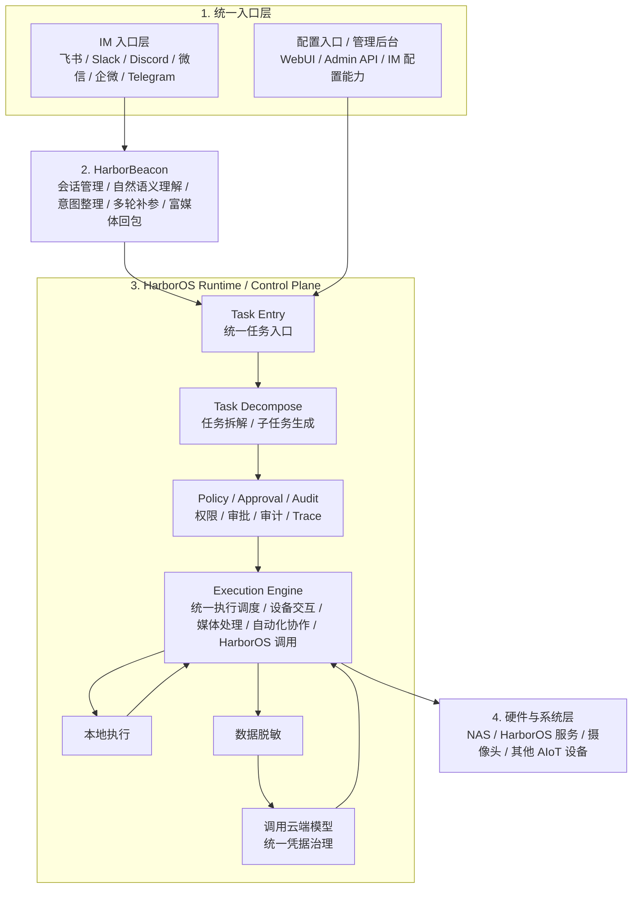

# Platform + Home Agent Hub Unified Architecture

更新时间：2026-04-15

## 1. 结论

HarborBeacon 后续长期框架不再采用“两条并行主链路”：

- 一条是原始 `Local Agent V2` 的通用助手 / 编排 / skills 主链路
- 一条是 `Home Agent Hub` 的摄像头 MVP 产品链路

统一后的目标是：

1. `Local Agent V2` 升格为平台主干（Platform Backbone）
2. `Home Agent Hub` 成为第一个正式垂直域（Vertical Domain）
3. HarborBeacon 成为统一北向入口
4. 所有产品入口最终都调用同一套 task / planner / runtime / policy / audit

换句话说，不是“让 Home Agent Hub 取代主链路”，也不是“让旧主链路继续独立演进后再硬适配摄像头场景”，而是：

`平台主干统一 + Home Agent Hub 入轨成为首个域产品`

当前已经冻结的项目北极星定义是：

`一个以 IM 为统一入口、以设备协同和媒体数据流为核心、以本地优先与云端补能为原则、通过智能编排、数据脱敏与统一账号凭据治理，统一编排家庭 AIoT 设备与 NAS/HarborOS 的本地优先家庭智能平台。`

---

## 2. 分层定义

### 2.1 统一入口层（Entry Layer）

统一入口层只承担用户进入系统与管理系统的职责，当前固定为两类入口：

- `IM 入口`
- `配置入口 / 管理后台`

两者是并列入口，都属于北向产品面，不应在业务上各自维护独立执行链。

### 2.2 HarborBeacon 交互层（Interaction Gateway）

HarborBeacon 负责：

- IM 渠道接入
- 会话管理
- 自然语义理解与意图整理
- 多轮补参与富媒体回包

HarborBeacon 不直接访问云端模型、不直接管理凭据、不直接访问设备后端；它只负责把自然语言和交互上下文送入统一 runtime。

### 2.3 平台主干 / Runtime + Control Plane

平台主干负责所有跨域通用能力：

- 统一 task intake / session / task state
- task decompose / planner / router / runtime
- policy / approval / audit
- skill registry / manifest / capability routing
- 本地执行 / 云端补能决策
- 数据脱敏与最小化上传
- 统一账号与凭据治理
- artifact / event / notification 的公共协议

这些能力不应在入口层重复实现，也不应携带摄像头品牌细节、RTSP 路径、飞书卡片样式等垂直产品细节。

### 2.4 硬件与系统层（Hardware and System Layer）

底层真实交互对象统一归于硬件与系统层：

- NAS / HarborOS 服务
- 摄像头
- 其他 AIoT 设备

平台与设备的交互必须经过 Runtime / Control Plane 统一调度。

### 2.5 垂直域（Vertical Domain）

Home Agent Hub 作为首个垂直域，负责：

- 摄像头发现与接入
- 设备注册中心
- RTSP / ONVIF / SSDP / mDNS / ffmpeg 等媒体与设备协议
- 视觉分析（YOLO / sidecar / vision summary）
- 实时观看、外网分享、截图、录像、云台控制
- 管理后台、移动配置页、首次绑定与设备配置体验

这些能力由域模块承载，但对平台暴露标准化 domain actions。

### 2.6 产品面（Product Surface）

以下组件属于产品面，而不是平台内核：

- `agent-hub-admin-api`
- mobile setup / static QR / binding flow
- camera live view / remote share page
- Home Agent Hub 专属 WebUI / 管理页

产品面可以有自己的页面和交互，但业务动作必须走统一 runtime，不应长期保留单独编排逻辑。

---

## 3. 统一总框架

当前冻结的总框架如下：

主链固定为：

`IM / 管理后台 -> HarborBeacon -> Runtime / Control Plane -> 硬件与系统层`

具体约束：

1. `HarborBeacon` 不直接绕过 Runtime 去调用云端模型、凭据系统或设备后端
2. `本地优先 / 云端补能` 是 Runtime 内部的执行路径，而不是独立主层
3. `统一凭据治理` 与 `数据脱敏` 都属于 Runtime / Control Plane 内部能力
4. 管理后台是并列入口，不是独立业务后端

完整数据模型已冻结在：[platform-home-agent-hub-data-model.md](./platform-home-agent-hub-data-model.md)

---

## 4. 模块归属

## 4.1 归入平台主干

- `harborbeacon/channels.py`
- `harborbeacon/dispatcher.py`
- `harborbeacon/intent.py`
- `harborbeacon/mcp_adapter.py`
- `src/orchestrator/*`
- `src/planner/*`
- `src/skills/*`
- 未来统一的 task / artifact / event / notification 契约

## 4.2 归入 Home Agent Hub 域

- `src/runtime/hub.rs`
- `src/runtime/discovery.rs`
- `src/runtime/media.rs`
- `src/runtime/remote_view.rs`
- `src/runtime/registry.rs`
- `src/adapters/onvif.rs`
- `src/adapters/ssdp.rs`
- `src/adapters/mdns.rs`
- `src/adapters/rtsp.rs`
- `src/orchestrator/executors/vision.rs`
- `src/domains/device.rs`
- 与摄像头页面、绑定、预览相关的管理 API

## 4.3 迁移态组件

以下组件当前仍有较多业务价值，但不应长期作为独立主链路存在：

- `src/bin/feishu_harbor_bot.rs`
- `src/bin/agent_hub_admin_api.rs`

迁移原则：

- 保留可运行性
- 逐步下沉业务逻辑到 domain action
- 最终只保留入口适配 / 调试桥 / 兼容层职责

---

## 5. 需要上升为平台抽象的 Home Agent Hub 能力

Home Agent Hub 已验证下列能力是“平台可复用能力”，不应继续只存在于旁路产品代码中：

### 5.1 Artifact Envelope

平台需要统一承载：

- 文本摘要
- 图片
- 录像文件
- 本地预览链接
- 签名分享链接
- 可点击动作卡片

### 5.2 Long-running Task

以下动作都不是单次同步 RPC：

- 扫描摄像头
- RTSP 探测
- 抓流
- 录像
- 视觉分析

平台必须支持异步 / 长耗时任务状态，而不仅是“命令执行成功 / 失败”。

### 5.3 Entity Resolution

平台要支持从自然语言中解析：

- 设备
- 房间
- 目标对象
- 绑定用户

例如“分析客厅摄像头”应映射到结构化 entity ref，而不是入口侧自行做字符串匹配。

### 5.4 Human-in-the-loop 补参

当前扫描与接入链路验证了如下交互是必要的：

- 扫描后返回候选列表
- 用户回复序号确认接入
- 系统发现认证失败后提示输入密码
- 用户补充密码后继续执行

这类会话式补参要变成 HarborBeacon 标准机制。

### 5.5 Sidecar Worker Pattern

平台需要统一支持与治理：

- `ffmpeg`
- YOLO / vision sidecar
- 浏览器 / 本地播放器
- 后续更多本地工具 worker

---

## 6. 迁移策略

## Phase A：定接口，不先重写

目标：

- 固化新的系统边界
- 避免在未定契约前大规模搬运代码

动作：

- 冻结 Assistant Task API
- 冻结第一批 `camera.*` domain actions
- 把 HarborBeacon 设为唯一北向入口目标

输出：

- 统一架构文档
- Task API 契约
- camera domain action 契约

## Phase B：让 HarborBeacon 吃下最小摄像头主链路

目标：

- HarborBeacon 直接承接最核心四条链路

第一批链路：

1. `扫描摄像头`
2. `接入 1`
3. `密码 xxxxxx`
4. `分析客厅摄像头`

动作：

- HarborBeacon 不再直接依赖旧旁路 bot 的整套业务逻辑
- 通过统一 Task API 调用 runtime

## Phase C：收口产品面，消灭双编排

目标：

- Admin API 与 HarborBeacon 共用同一业务底座

动作：

- 扫描、接入、抓拍、分析等动作不再在页面层各自编排
- 页面只负责配置和展示
- 业务动作通过同一 task / runtime 入口执行

## Phase D：治理补齐

目标：

- 让 Home Agent Hub 从“可演示 MVP”升级为“平台内正式域”

优先补齐：

- access control
- approval flow
- notification contract
- event/audit correlation

## Phase E：退役旧旁路主链路

目标：

- `feishu_harbor_bot` 从主入口降级为兼容桥、调试器或迁移过渡层

退出条件：

- HarborBeacon 已稳定承接飞书主入口
- camera domain actions 已覆盖核心需求
- admin/web/IM 已共用同一 runtime

---

## 7. 里程碑

### M1：统一架构冻结

- 文档口径统一
- 平台 / 域 / 产品面边界清晰
- 第一批 camera actions 冻结

### M2：HarborBeacon 接入摄像头主链路

- HarborBeacon 可发起 `camera.scan`
- HarborBeacon 可继续 `camera.connect`
- HarborBeacon 可执行 `camera.analyze`

### M3：单一业务底座

- Web / Mobile / IM 共用同一 task/runtime
- `task_id` / `executor_used` / `audit_ref` 统一

### M4：Home Agent Hub 成为首个正式垂直域

- 治理补齐
- 旧旁路 bot 降级
- 平台可继续承载第二个垂直域

---

## 8. 当前优先级

P0:

1. 统一文档口径与主执行路线
2. 定义 Task API 与 `camera.*` 动作契约
3. 让 HarborBeacon 接入最小摄像头主链路

P1:

1. 把 Admin API / WebUI 动作改为复用统一 runtime
2. 补 access / approval / notification / event 抽象
3. 收口 artifact / share-link / media result contract

P2:

1. 退役旧旁路编排
2. 为第二个垂直域预留可复制接入模板

